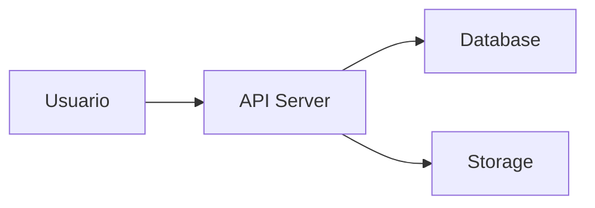

# Contributing to CDN Offline

¡Gracias por tu interés en contribuir al proyecto CDN Offline! 🎉

Este documento proporciona pautas para contribuir al proyecto.

---

## 🎯 Cómo Puedes Contribuir

### 1. Reportar Bugs 🐛
Si encuentras un bug, abre un Issue con:
- Descripción clara del problema
- Pasos para reproducirlo
- Comportamiento esperado vs. actual
- Screenshots o logs (si aplica)
- Tu entorno (OS, versión de Node.js, etc.)

**Template**:
```
**Descripción del bug**
[Descripción clara del problema]

**Pasos para reproducir**
1. ...
2. ...
3. ...

**Comportamiento esperado**
[Qué esperabas que sucediera]

**Comportamiento actual**
[Qué sucedió en realidad]

**Entorno**
- OS: [e.g., Ubuntu 22.04]
- Node.js: [e.g., 18.19.0]
- PostgreSQL: [e.g., 14.10]
```

---

### 2. Sugerir Mejoras 💡
Abre un Issue con:
- Descripción de la mejora propuesta
- Caso de uso (¿por qué es útil?)
- Posible implementación (opcional)

---

### 3. Mejorar Documentación 📚
La documentación nunca está completa. Puedes:
- Corregir errores tipográficos
- Aclarar secciones confusas
- Agregar ejemplos
- Traducir a otros idiomas
- Mejorar diagramas

**Proceso**:
1. Fork el repositorio
2. Edita los archivos en `/docs/`
3. Envía un Pull Request

---

### 4. Contribuir Código 💻

#### Setup del Entorno de Desarrollo
```bash
# 1. Fork el repositorio en GitHub

# 2. Clonar tu fork
git clone https://github.com/TU_USUARIO/cdn-offline.git
cd cdn-offline

# 3. Agregar upstream
git remote add upstream https://github.com/ORIGINAL_OWNER/cdn-offline.git

# 4. Seguir el QUICKSTART.md para setup local
# Ver: QUICKSTART.md

# 5. Crear una branch para tu feature
git checkout -b feature/tu-feature-name
```

#### Estándares de Código

**Backend (Node.js/TypeScript)**:
- Usar TypeScript estricto
- Seguir ESLint config del proyecto
- Mínimo 70% de cobertura de tests
- Documentar funciones complejas con JSDoc

```typescript
/**
 * Calcula el score de retención para un contenido
 * usado en el algoritmo LRU de eviction.
 * 
 * @param accessCount - Número de accesos al contenido
 * @param daysSinceAccess - Días desde último acceso
 * @param priority - Prioridad del contenido (1-10)
 * @returns Score de retención (menor = mejor candidato para eliminar)
 */
function calculateRetentionScore(
  accessCount: number, 
  daysSinceAccess: number, 
  priority: number
): number {
  return (accessCount / daysSinceAccess) * priority;
}
```

**Frontend (React/TypeScript)**:
- Componentes funcionales con hooks
- Props tipados con TypeScript
- CSS: Tailwind classes preferiblemente
- Accesibilidad: usar semantic HTML y ARIA labels

```tsx
interface VideoCardProps {
  title: string;
  thumbnail: string;
  duration: number;
  onClick: () => void;
}

const VideoCard: React.FC<VideoCardProps> = ({ 
  title, 
  thumbnail, 
  duration, 
  onClick 
}) => {
  return (
    <div 
      className="cursor-pointer rounded-lg shadow hover:shadow-lg"
      onClick={onClick}
      role="button"
      aria-label={`Play video: ${title}`}
    >
      
      <h3>{title}</h3>
      <span>{formatDuration(duration)}</span>
    </div>
  );
};
```

#### Testing
- Agrega tests para todo código nuevo
- Tests unitarios: Jest
- Tests de integración: Supertest
- Tests E2E: Playwright

```typescript
describe('ContentService', () => {
  it('should return content by ID', async () => {
    const content = await contentService.getById('123');
    expect(content).toBeDefined();
    expect(content.id).toBe('123');
  });
});
```

#### Commits
Usa mensajes de commit descriptivos siguiendo [Conventional Commits](https://www.conventionalcommits.org/):

```
feat: add video seeking functionality
fix: resolve buffer overflow in streaming
docs: update architecture diagram
test: add unit tests for eviction service
refactor: simplify cache invalidation logic
chore: update dependencies
```

**Formato**:
```
<type>(<scope>): <subject>

<body>

<footer>
```

**Tipos**:
- `feat`: Nueva funcionalidad
- `fix`: Corrección de bug
- `docs`: Cambios en documentación
- `style`: Formato (no afecta código)
- `refactor`: Refactorización
- `test`: Agregar/modificar tests
- `chore`: Mantenimiento (deps, config)

#### Pull Requests

**Antes de enviar**:
1. Actualiza tu branch con upstream
   ```bash
   git fetch upstream
   git rebase upstream/main
   ```
2. Ejecuta todos los tests
   ```bash
   npm test
   npm run test:integration
   npm run test:e2e
   ```
3. Ejecuta linter
   ```bash
   npm run lint
   npm run format
   ```
4. Verifica que el build funciona
   ```bash
   npm run build
   ```

**Template de PR**:
```markdown
## Descripción
[Descripción clara de los cambios]

## Tipo de cambio
- [ ] Bug fix (cambio que arregla un issue)
- [ ] Nueva funcionalidad (cambio que agrega funcionalidad)
- [ ] Breaking change (cambio que rompe compatibilidad)
- [ ] Documentación

## ¿Cómo se ha probado?
[Describe las pruebas que ejecutaste]

## Checklist
- [ ] Mi código sigue el estilo del proyecto
- [ ] He agregado tests que prueban mi cambio
- [ ] Todos los tests pasan localmente
- [ ] He actualizado la documentación
- [ ] He agregado comments en código complejo
```

---

## 🏗️ Áreas de Contribución

### Alta Prioridad 🔥
- [ ] Implementación del backend (API endpoints)
- [ ] Implementación del frontend (UI components)
- [ ] Sistema de autenticación (JWT)
- [ ] Upload de archivos con FFmpeg transcoding
- [ ] Algoritmo de eviction (LRU)

### Media Prioridad 📊
- [ ] Tests de integración
- [ ] Tests E2E con Playwright
- [ ] Dashboard de admin
- [ ] Analytics y estadísticas
- [ ] Mejoras de UX

### Baja Prioridad 💭
- [ ] Mobile app (React Native)
- [ ] Integración con IA (recomendaciones)
- [ ] Subtítulos automáticos
- [ ] Multi-idioma (i18n)

---

## 📝 Estilo de Documentación

Al agregar/modificar documentación:

### Markdown
- Usa headers apropiados (`#`, `##`, `###`)
- Incluye ejemplos de código con syntax highlighting
- Agrega diagramas Mermaid para conceptos visuales
- Usa listas para pasos secuenciales

### Diagramas Mermaid
```markdown

\```
```

### Código
- Incluye comentarios explicativos
- Usa nombres descriptivos de variables
- Divide código largo en secciones lógicas

---

## 🤝 Código de Conducta

### Nuestro Compromiso
Este proyecto está comprometido con proporcionar un ambiente acogedor y libre de acoso para todos.

### Comportamiento Esperado
- ✅ Ser respetuoso con otros contribuidores
- ✅ Usar lenguaje inclusivo
- ✅ Aceptar críticas constructivas
- ✅ Enfocarse en lo mejor para la comunidad
- ✅ Mostrar empatía hacia otros

### Comportamiento Inaceptable
- ❌ Lenguaje o imágenes sexualizadas
- ❌ Trolling, comentarios insultantes
- ❌ Acoso público o privado
- ❌ Publicar información privada sin permiso
- ❌ Cualquier conducta no profesional

### Aplicación
Instancias de comportamiento inaceptable pueden ser reportadas a [email del proyecto]. Todas las quejas serán revisadas e investigadas.

---

## 🎓 Para Nuevos Contribuidores

Si eres nuevo en open source o este es tu primer PR:

1. **Empieza pequeño**: Busca issues marcados como `good first issue`
2. **Lee la documentación**: Especialmente [Architecture](./docs/architecture.md)
3. **Pregunta**: Abre un issue si tienes dudas
4. **No te desanimes**: Todos empezamos desde cero

### Recursos Útiles
- [How to Contribute to Open Source](https://opensource.guide/how-to-contribute/)
- [First Contributions](https://github.com/firstcontributions/first-contributions)
- [Conventional Commits](https://www.conventionalcommits.org/)

---

## 📞 Contacto

**Preguntas sobre contribución**:
- Abre un Issue con la etiqueta `question`
- Email del proyecto: [email]
- Discord/Slack: [link si existe]

**Mantenedores**:
- [Nombre] - [@github-username]

---

## 🙏 Agradecimientos

Gracias a todos los contribuidores que han ayudado a hacer este proyecto realidad:

<!-- Automáticamente generado con all-contributors -->
<!-- Ver: https://allcontributors.org/ -->

---

**¡Tu contribución, grande o pequeña, hace la diferencia!** 🚀

