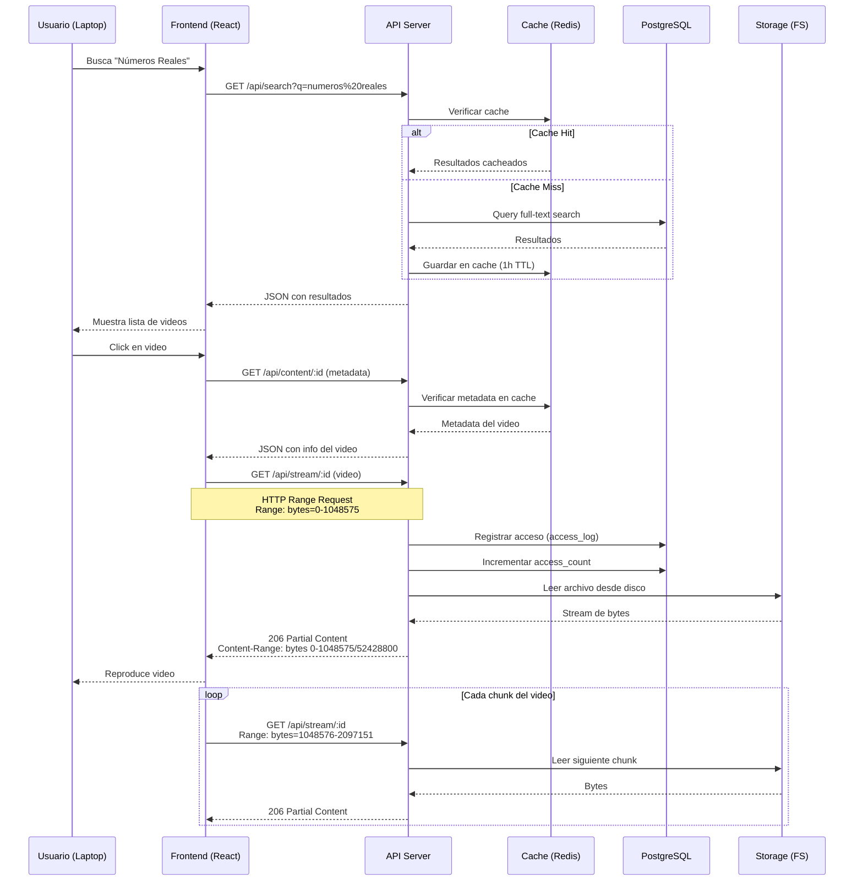
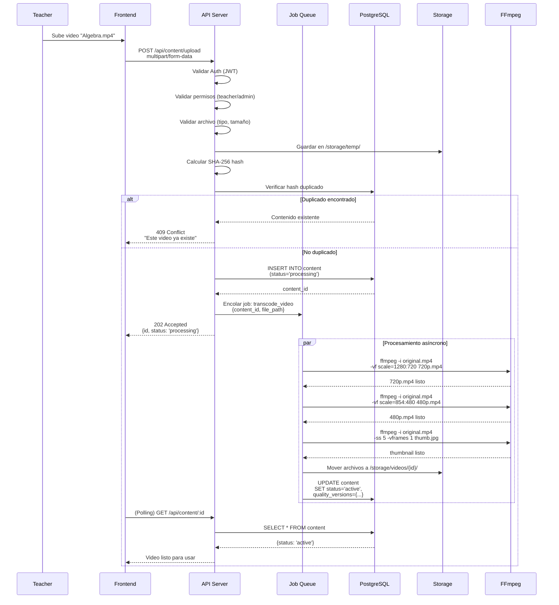
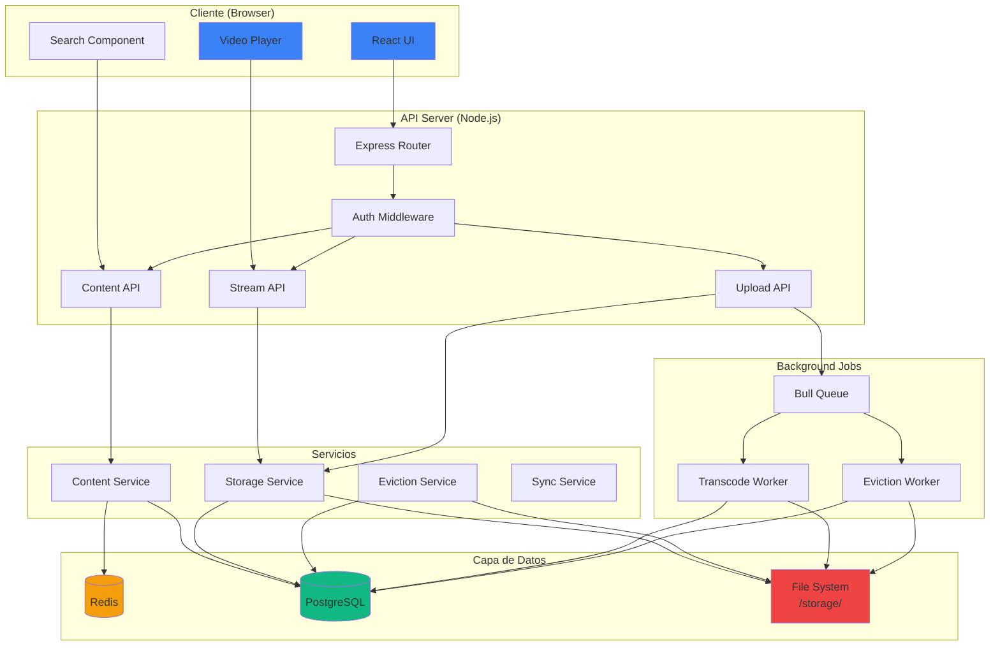
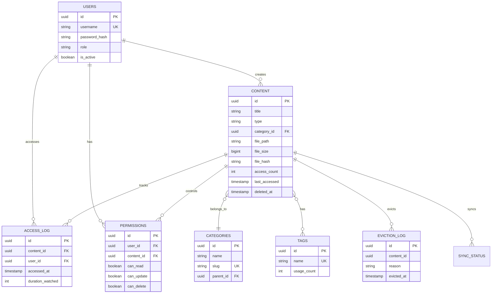
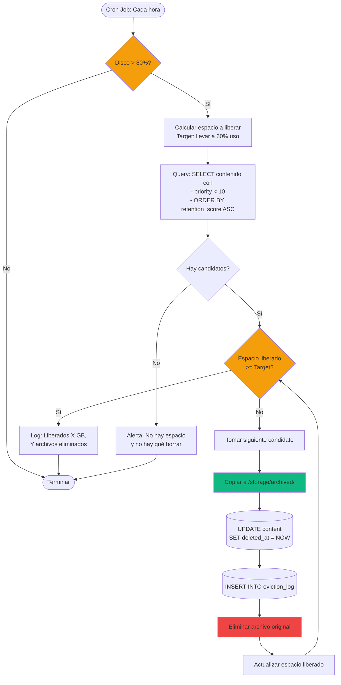
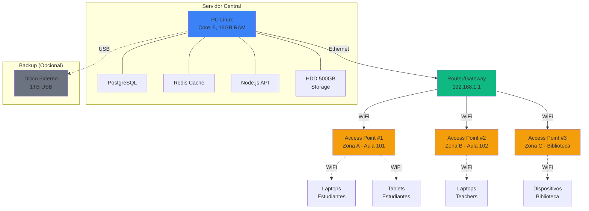
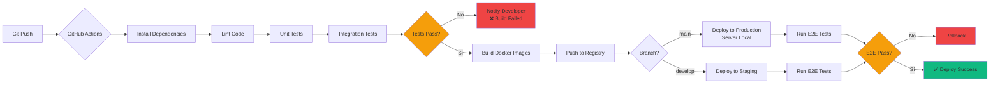
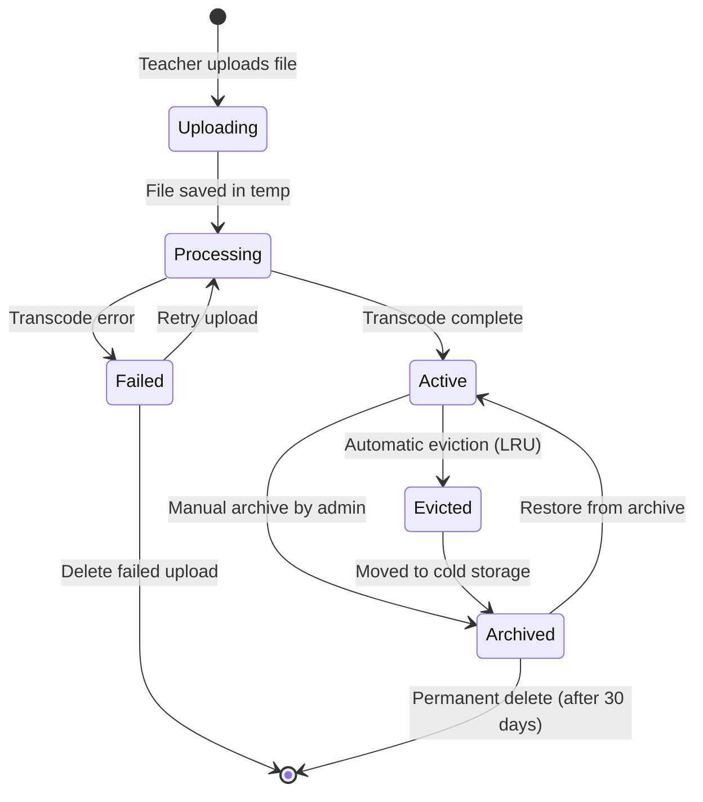
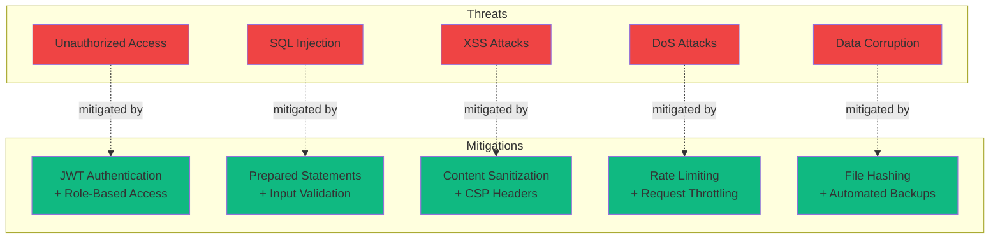
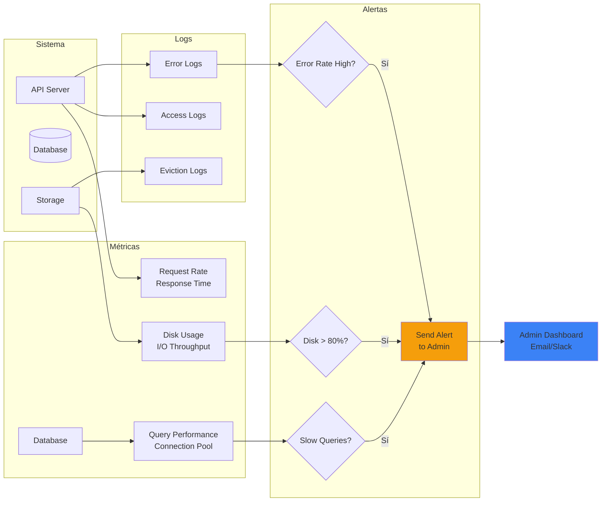

# Diagramas de Arquitectura - CDN Offline

## 1. Flujo de Solicitud de Contenido

---

## 2. Flujo de Upload de Contenido

---

## 3. Arquitectura de Componentes

---

## 4. Modelo de Datos (ER Simplificado)

---

## 5. Flujo de Eviction (LRU)

---

## 6. Arquitectura Física de Red

---

## 7. Pipeline CI/CD

---

## 8. Diagrama de Estados del Contenido

---

## 9. Threat Model (Seguridad)

---

## 10. Monitoreo y Observabilidad

---

Estos diagramas proporcionan una visualización completa de:
- ✅ Flujos de datos y procesos
- ✅ Arquitectura de componentes
- ✅ Modelo de datos
- ✅ Decisiones de diseño
- ✅ Consideraciones de seguridad
- ✅ Estrategias de monitoreo
